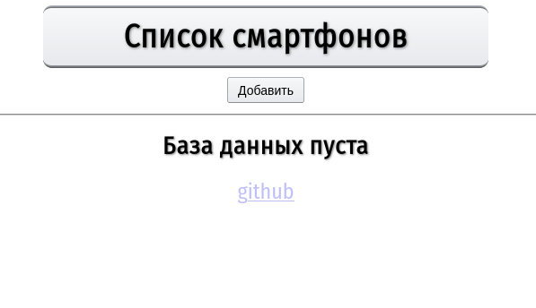

# CRUD application example
## Описание
- Реализация CRUD-приложения на Servlet API 4.0.
- В основе — Java 11. Для локального запуска достаточно клонировать репозиторий и иметь установленные Java 11+ и Maven.
- Запуск происходит на порту 8080 (можно изменить в `config.properties`).
- DAO-слой покрыт тестами.

## Установка
Клонируем репозиторий (и заходим в его корневой каталог):
```
$ git clone https://github.com/defaultuname/crud-servlet-ex.git
``` 
**Используя Maven**, пишем:
```
$ mvn clean install
```
И, наконец, запускаем приложение: 
```
$ mvn exec:java
```

## Технологии
- Servlet API 4.0, Tomcat 8.5 (его embedded версия).
- В качестве БД — H2 (in memory mode), Liquibase отвечает за инициализацию БД при запуске (также возможна инициализация силами самого H2, для этого в корне проекта приложен файл data.sql). Доступ к БД через JDBC.
- JUnit 5 для тестов, логирование через logback.
- В качестве фронт-части — JSP и немного CSS.

## Ещё немного про БД
Доступ к БД можно получить по URL /console.  
Стандартные данные:  
URL: `jdbc:h2:mem:smartphone`  
User name: `sa`  
Password:`      `  (пароль пустой)  
Всё это можно сконфигурировать в `config.properties`


## Скриншоты
<p align="center">

<hr>
<p align="center">

<hr>
<p align="center">

